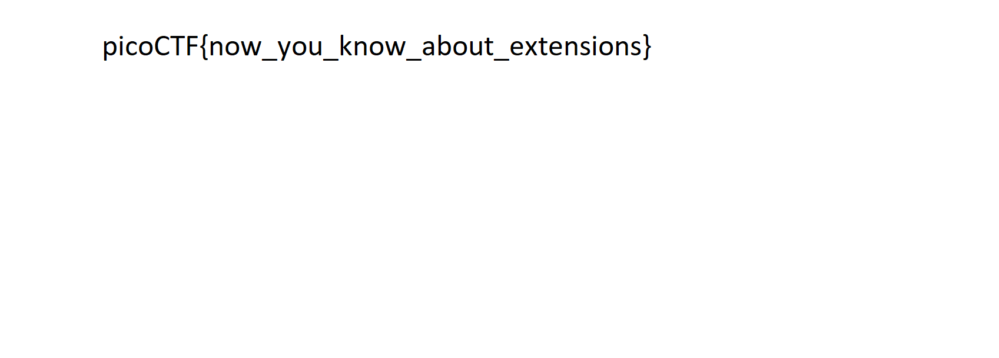

Here is the complete, structured writeup based on the actions you took to solve the **extensions** challenge.

---

# PicoCTF Challenge Writeup: extensions

## Challenge Information

* **Name:** extensions
* **Category:** Forensics
* **Difficulty:** Medium
* **Authors:** Sanjay C / Danny
* **Description:** This is a really weird text file. Can you find the flag?

---

## Technical Overview

Operating systems often rely on file extensions (like `.txt`, `.jpg`, `.exe`) to know which application should open a file. However, the true identity of a file is determined by its **file signature** (also known as **magic bytes**)—a unique sequence of bytes at the very beginning of the file.

This challenge provides a file named `flag.txt`, but its extension does not match its actual contents.

---

## Step-by-Step Solution

### Step 1: Initial Inspection

An initial attempt to look for plain text strings inside `flag.txt` using `strings` returns nothing useful:

```bash
strings flag.txt | grep "pico"

```

Because the output is empty, it strongly indicates that the file is not a standard text file, but rather a compiled or binary file format.

---

### Step 2: Verifying the Real File Type

To determine what the file actually is, use the `file` command. This command ignores the `.txt` extension and inspects the magic bytes at the beginning of the file payload:

```bash
file flag.txt

```

**Output:**

```text
flag.txt: PNG image data, 1697 x 608, 8-bit/color RGB, non-interlaced

```

The `file` utility reveals that the file is actually a **PNG image**, despite being named with a `.txt` extension.

---

### Step 3: Correcting the Extension and Viewing the Flag

To view the contents properly, change the file extension from `.txt` to `.png` using the `mv` (move/rename) command:

```bash
mv flag.txt flag.png

```

Once renamed, open `flag.png` using any image viewer available on your system (such as `xdg-open flag.png`, `eog flag.png`, or by double-clicking it in your file manager).

The image renders clearly on screen, displaying the flag text visually within the picture.
Step 4: Viewing the Image to Retrieve the Flag
With the file extension correctly updated to a PNG, open the image using your preferred image viewer or CLI utility:

Bash

Upon opening the image, the flag text is clearly displayed across the center of the image canvas.

Flag
picoCTF{w1nd0w5_v1574_m4g1c}